<div align="center">

# MIRA (मीरा)

### Mitra for Intelligent Rural Analytics

**AI-driven cash flow prediction and early risk flagging for rural micro enterprises**

*NABARD Hackathon @ GFF 2026 | Team Code Wizards*

</div>

---

## 1. The Problem

India's rural micro enterprises, including SHGs, FPOs, dairy units, poultry farms, handicraft clusters and village retail shops, run on thin margins and irregular cash flows. Financial stress builds silently: fodder prices creep up, a monsoon fails, savings deposits stop. By the time a missed EMI appears in a bank's records, the damage is already done. Field officers manage dozens of enterprises with no early visibility, and the enterprises themselves have no simple way to see what is coming.

## 2. Our Solution

MIRA gives every rural enterprise a *mitra* (friend): a bilingual, offline-first web app that turns 30 seconds of daily bookkeeping into:

- a **6-month probabilistic cash flow forecast** (P10 / P50 / P90 bands),
- a transparent **MIRA Score (0 to 100)** with Green / Watch / At-Risk bands,
- **11 early-warning signals** that fire weeks before the first missed payment,
- a **Credit Passport PDF** that converts good records into bank-ready proof,
- and **MitraBot**, a conversational assistant grounded in the enterprise's own data.

On the other side, NABARD field officers get a portfolio dashboard that catches stress before it becomes default: risk-ranked enterprise lists, a signal-grouped risk panel, what-if climate and price scenario simulation, a prioritized message inbox and one-click intervention tools.

---

## 3. Screenshots

### Beneficiary (Udyami) App

| Login | Home Dashboard |
|---|---|
| 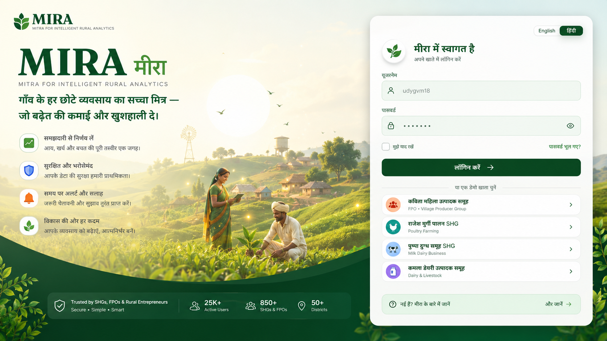 | 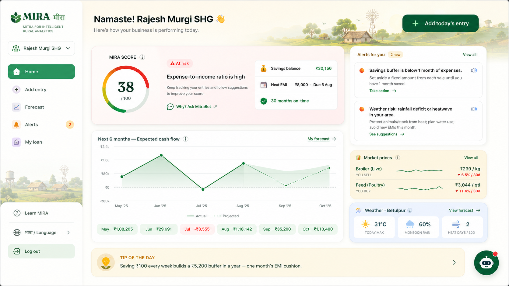 |

| Add Entry (30-second bookkeeping) | 6-Month Forecast |
|---|---|
| 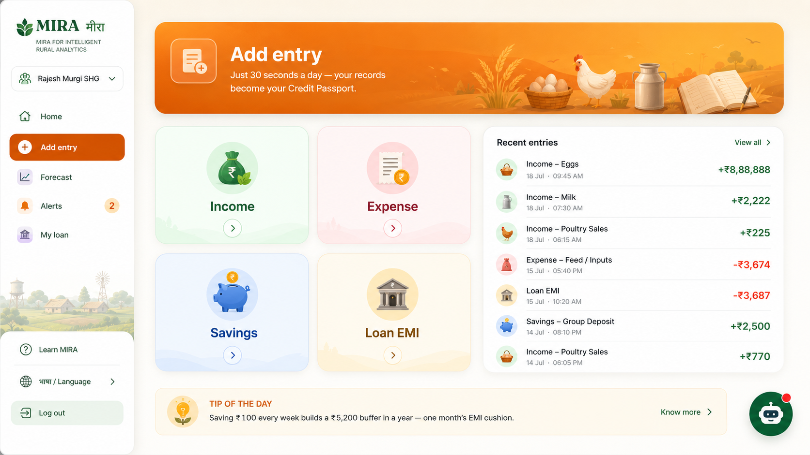 | 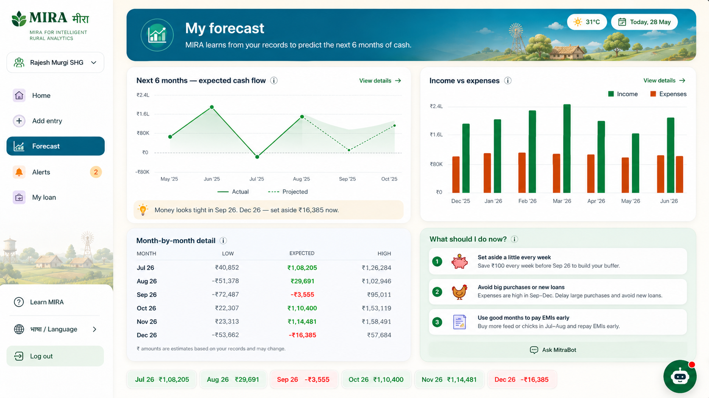 |

| Alerts and Advice | My Loan and Credit Passport |
|---|---|
| 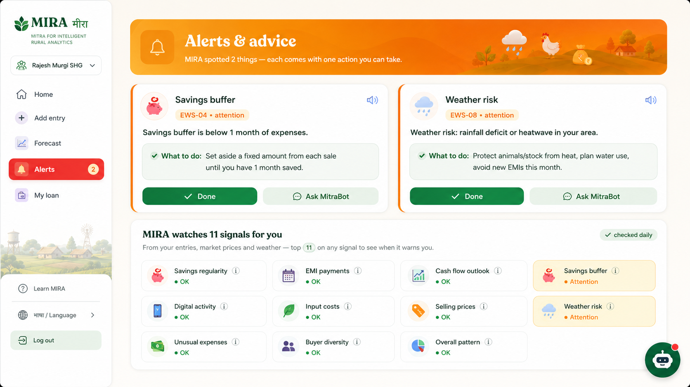 | 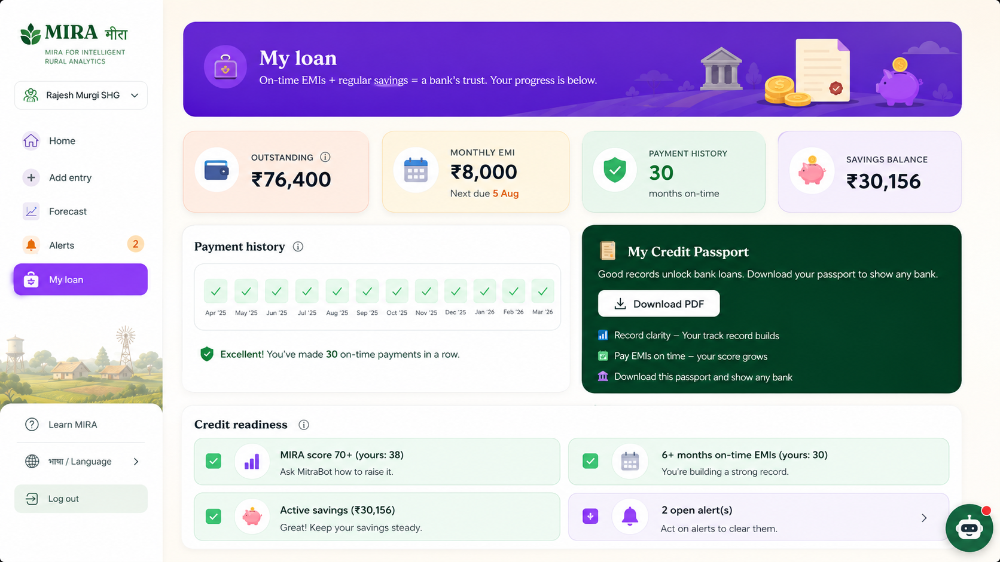 |

### Field Officer (Adhikari) Dashboard

| Portfolio Overview | Enterprises (risk-ranked) |
|---|---|
| 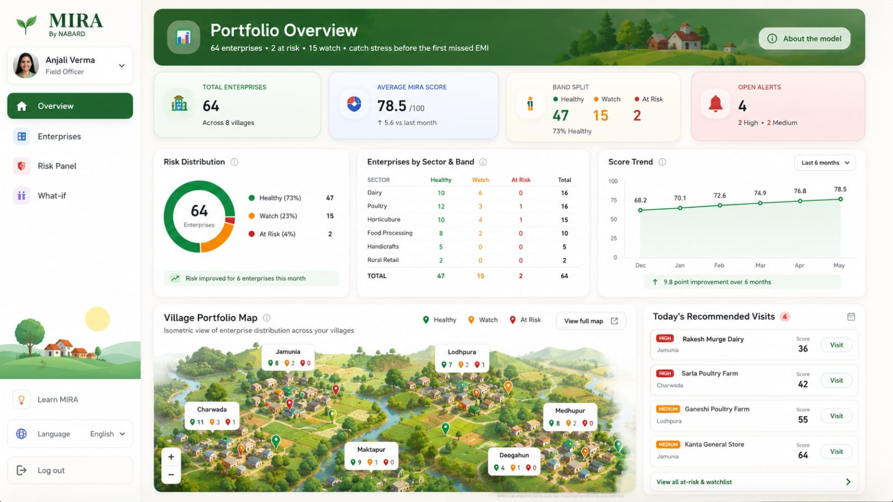 | 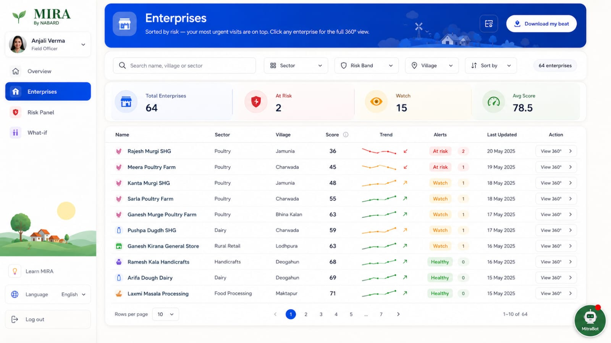 |

| Risk Panel (signal-grouped) | What-if Scenario Studio |
|---|---|
| 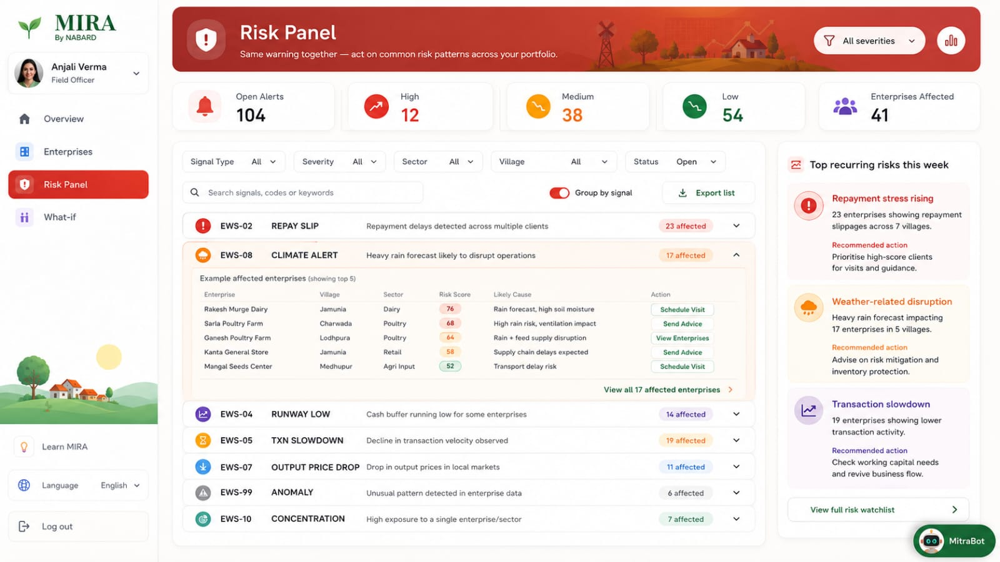 | 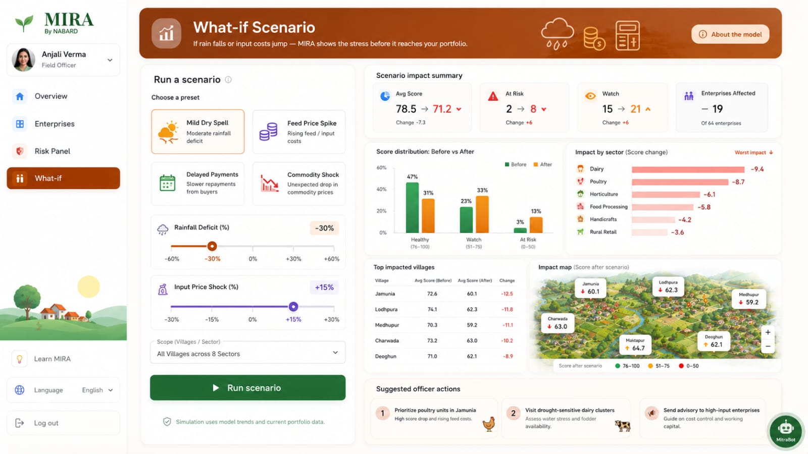 |

| Enterprise 360 view |
|---|
| 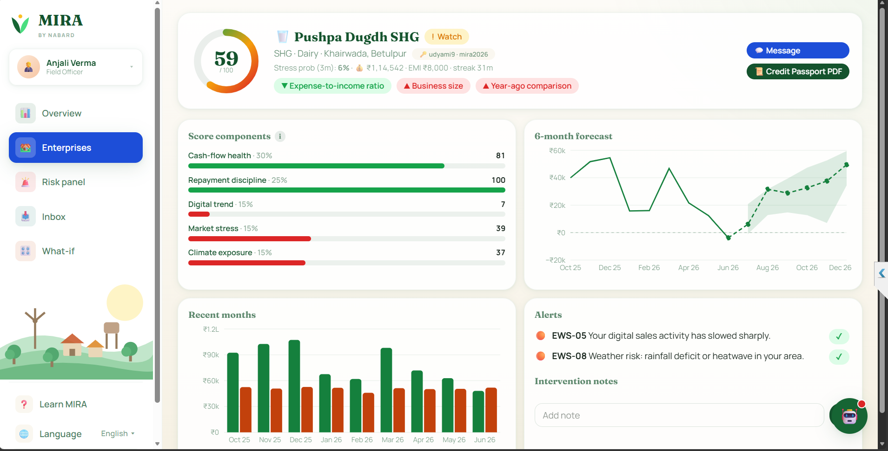 |

---

## 4. Feature Tour

### For the enterprise (farmer / SHG / FPO)

| Feature | What it does |
|---|---|
| **Health Card** | Spectrum score gauge, plain-language reason from the model's top driver, savings, next EMI, on-time streak |
| **Add Entry** | Icon-first, keypad-based entry of income / expense / savings / EMI in under 30 seconds; category icons per sector |
| **Linked accounting** | One money pool: income and deposits credit the savings balance, expenses and loan payments debit it; a loan payment larger than the available balance or the outstanding amount is rejected on the server |
| **My Forecast** | History plus 6-month forecast chart with likely-range band, month-by-month Low / Expected / High table, an adaptive "what should I do now" plan |
| **Alerts and Advice** | Every active warning with one concrete action, text-to-speech playback for low-literacy users, and a board of all 11 signals MIRA watches with per-signal trigger explanations |
| **My Loan** | Outstanding, EMI, payment history grid, on-time streak; prepayments reduce the EMI (tenure preserved) and full repayment closes the loan with celebration and a passport entry |
| **Credit Passport** | One-page PDF: score, sub-scores, forecast, repayment record, risk flags, drivers; downloadable by the enterprise itself (data ownership) |
| **Messages** | Direct thread with the assigned field officer, unread badges, daily send cap so the channel stays advisory |
| **Personalized tip** | A daily tip chosen from the enterprise's own situation (missed EMI, upcoming deficit month, low buffer, price or weather signals) with an expandable "why this helps" panel |
| **MitraBot** | Streaming chatbot grounded in the user's live score, forecast, alerts, prices and weather; answers in simple Hindi or English |

### For the field officer

| Feature | What it does |
|---|---|
| **Portfolio Overview** | KPI tiles, risk donut, sector x band matrix, 6-month score trend, village map (interactive 3D view), today's recommended visits |
| **Enterprises** | Search and filters, stats strip, risk-ranked table with trend sparklines, alert chips, pagination, one-click 360 view |
| **Enterprise 360** | Sub-score bars, SHAP driver chips, forecast, cash flow history, alert acknowledgement, intervention notes, Credit Passport generation, direct messaging. The beneficiary's private savings balance is deliberately not shown |
| **Risk Panel** | Alerts grouped by signal with affected counts, expandable top-affected tables with likely cause and quick actions (Schedule Visit, Send Advice), CSV export, top recurring risks rail |
| **Inbox** | All beneficiary conversations triaged by unread status and risk band, so an at-risk enterprise's message is never buried |
| **What-if Studio** | Preset and custom climate / price scenarios re-run the actual models across the portfolio: before vs after distribution, sector impact, top affected villages, a recolored 3D impact map and suggested officer actions |
| **About the model** | Honest numbers in-app: backtest WAPE per horizon vs baseline, classifier AUC, score design and weights |

### Platform capabilities

- **Offline-first PWA**: entries write to IndexedDB first and sync with server-side deduplication; API responses are cached for offline rendering; installable on Android home screens
- **Bilingual everywhere**: full English / Hindi toggle including alerts, tips and the chatbot; voice input via the Web Speech API
- **Privacy by design**: JWT role guards, enterprises can only access their own data, officer views exclude private savings information
- **Single-process demo**: the FastAPI server serves the built frontend, one command runs everything

---

## 5. The ML Core

| Component | Approach |
|---|---|
| **Synthetic data** | 64 enterprises x 30 months of daily ledger, digital activity, mandi prices and district weather, with engineered storylines: feed-price shock, drought district, idiosyncratic stress, borderline cases |
| **Features** | Pooled monthly panel across all enterprises (solves cold start): cash flow lags and rolling stats, savings regularity, EMI on-time rate, digital activity slopes, sector input / output price momentum, cost-price squeeze, rainfall deviation, heat days, seasonality |
| **Forecasting** | LightGBM quantile regressors (alpha 0.1 / 0.5 / 0.9) for each horizon 1 to 6 months, validated with expanding-window backtests against a seasonal-naive baseline |
| **Risk score** | Transparent weighted scorecard: cash flow health 30%, repayment discipline 25%, digital trend 15%, market stress 15%, climate exposure 15%; bands Green >= 70, Watch 45 to 69, At-Risk < 45 |
| **Stress classifier** | Calibrated LightGBM classifier predicting stress within 3 months, explained with SHAP top-driver chips in plain language (English and Hindi) |
| **Early warnings** | Declarative rule engine with 11 signals (savings break, repayment slip, cash flow deterioration, low runway, transaction slowdown, input price shock, output price drop, climate alert, expense spike, buyer concentration, anomaly) |
| **What-if** | The same feature pipeline re-run with shocked rainfall and input-price columns, then re-scored, so scenario results come from the real models rather than a mock |

**Honest backtest numbers** (shown inside the app under "About the model"):

- Forecast WAPE beats the seasonal-naive baseline by **23% to 41% across all 6 horizons**
- Stress classifier AUC ~ 0.66 at a 7% positive rate, probability-calibrated
- Model outputs are decision support, not a credit decision, and the app says so

---

## 6. Tech Stack

| Layer | Technology |
|---|---|
| Frontend | React 19, TypeScript, Vite 8, Tailwind CSS 4, React Router 7, Zustand, Recharts, Three.js (react-three-fiber + drei), Dexie (IndexedDB), react-i18next, vite-plugin-pwa (Workbox) |
| Backend | FastAPI, SQLAlchemy 2 (SQLite), Pydantic v2, python-jose (JWT), pandas / numpy, ReportLab (PDF), SSE streaming |
| ML | LightGBM, scikit-learn (calibration), SHAP, statsmodels, joblib |
| Chatbot | Google Gemini API (server-side only; the key never reaches the browser), with multi-key failover |
| Quality | pytest suite (scoring math, EWS rules, auth guards, sync idempotency), Lighthouse-audited (Accessibility 100, Best Practices 100) |

---

## 7. Architecture

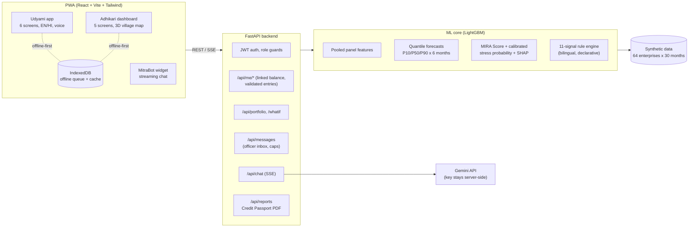

---

## 8. Getting Started

### Prerequisites

- Python 3.11+
- Node.js 20.19+ (build works on 20.13 with a warning)

### Setup (3 steps)

```bash
# 1. Backend
cd mira/backend
python -m venv .venv
.venv\Scripts\activate          # Windows (use source .venv/bin/activate on Linux/Mac)
pip install -r requirements.txt

# 2. Generate data, train models, score the portfolio (one time, ~2 minutes)
python ml/generate_data.py
python ml/train_forecast.py
python ml/train_risk.py
python ml/score_all.py

# 3. Frontend build + run everything as one process
cd ../frontend && npm install && npm run build
cd ../backend && uvicorn app.main:app --port 8000
```

Open **http://localhost:8000**. On Windows you can also just run `mira/start.bat`.

To enable MitraBot, create `mira/backend/.env`:

```
GEMINI_API_KEYS=key1,key2,key3
JWT_SECRET=any-long-random-string
```

### Demo accounts (password: `mira2026`)

| Persona | Username | Storyline |
|---|---|---|
| Field officer | `officer1` | Full portfolio dashboard |
| At-risk enterprise | `udyami18` | Poultry unit hit by a feed price shock |
| Watchlist enterprise | `udyami9` | Dairy SHG in the drought district |
| Any enterprise | `udyami1` to `udyami64` | Every enterprise in the officer's list has a matching login (browse them all on the login page) |

### Tests

```bash
cd mira/backend
python -m pytest tests/ -q        # 17 tests: scoring, EWS rules, auth, sync idempotency
```

---

## 9. Project Structure

```
NABARD_Hackathon/
├── README.md                     <- you are here
├── docs/screenshots/             <- interface images
├── NABARD_Problem_Statment.pdf   <- the challenge
├── NABARD_Solution.txt           <- solution design document
├── implementation.txt            <- build plan
└── mira/
    ├── start.bat                 <- one-click demo launcher (Windows)
    ├── DEMO.md                   <- 6-minute demo script
    ├── backend/
    │   ├── app/                  <- FastAPI: routers, models, services, store
    │   ├── ml/                   <- data generator, features, training, EWS, scorer
    │   ├── data/                 <- generated CSVs (mira.db is created at runtime)
    │   └── tests/                <- pytest suite
    └── frontend/
        └── src/
            ├── pages/udyami/     <- 6 beneficiary screens
            ├── pages/adhikari/   <- 6 officer screens
            ├── components/       <- UI kit, charts, MitraBot, chat, guide
            ├── offline/          <- Dexie queue + cache
            ├── three/            <- 3D village map and login field
            └── i18n/             <- English / Hindi resources
```

---

## 10. Design Principles

1. **Predict, do not just record.** Every entry feeds a forecast; the app always looks forward.
2. **Warn before the default.** Signals fire on leading indicators (activity slowdown, price squeeze, weather) weeks before a missed EMI.
3. **Explain everything.** Transparent score weights, SHAP drivers in plain words, per-signal trigger tooltips, a full in-app "Understanding MIRA" guide for SHG members.
4. **Respect the user.** Icon-first entry for low literacy, Hindi throughout, voice input, text-to-speech alerts, offline-first for 2G villages.
5. **Financial integrity.** One linked money pool; the server rejects payments that the balance cannot cover; prepayment fairly reduces the EMI.
6. **Privacy by role.** The officer sees what is needed to help with credit, never the beneficiary's private savings.

---

<div align="center">

**Team Code Wizards** | NABARD Hackathon @ GFF 2026

*MIRA is a prototype built on synthetic data. Model outputs are decision support, not a credit decision.*

</div>
